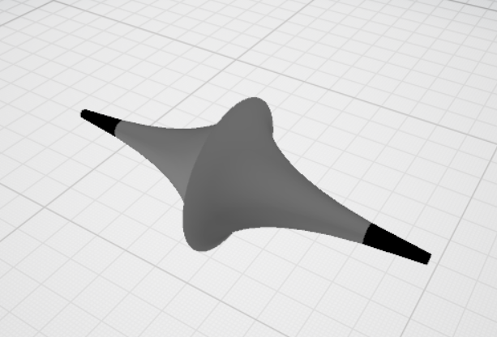
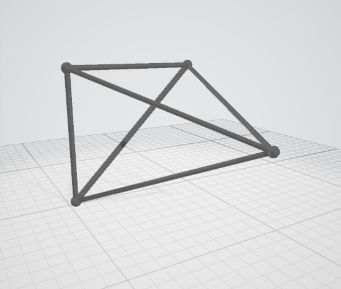

Программа сожержит реализация следующих вещей:

1.Точка в пространстве.

2.Построение сферы вокруг точки

3.Обтягивание отрезка цилиндром 

4.Отрисовка тэтраэдра(рамы)

5.Отрисовка Псевдосферы(задана параметрически)

6.Генерация PLY-файла по списку вершин и граней.

 Результаты отрисовки тэтраэдра и псевдосферы:
 
 
